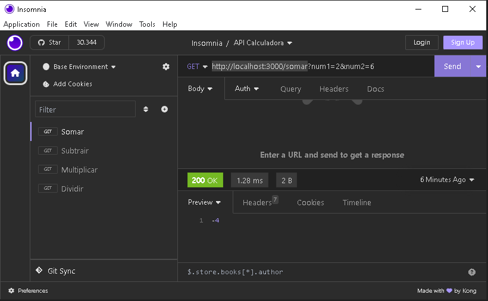

# calculadora_nodejs
Calculadora usando o Node.js e o Insomnia

O servidor tem 4 rotas GET para executar as 4 operações matemáticas básicas (somar, subtrair, multiplicar, dividir)

-rota para soma : http://localhost:3000/somar
-rota para subtração : http://localhost:3000/diminuir
-rota para multiplicação : http://localhost:3000/mutiplicar
-rota para divisão : http://localhost:3000/dividir

-Para iniciar o servidor deve ter instalado o Insomnia para realizar os testes.
-Os 2 numeros desejados devem ir como os exmplos a seguir

    

   

    

  

    

  

    

   

